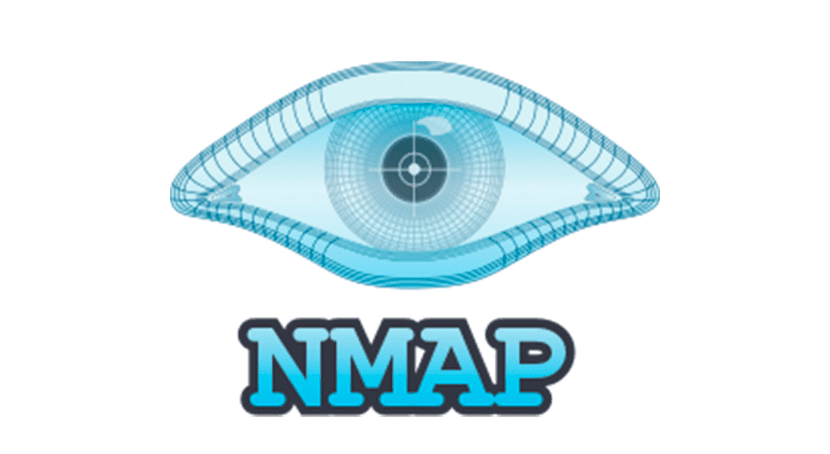

<h1 align="center">Hi 👋, I'm Andres Galvis</h1>

<!--   -->
      

<h3 align="center"Cybersecurity Analyst with experience in Data Engineering, Python, and Automation</h3>

  

<h3 align="center">Cybersecurity Analyst | Data & Automation Background | Systems Engineer from Colombia</h3>

---

## 👨‍💻 About Me

I’m Andres Galvis, a Systems & computing Engineer from Colombia with a growing focus on **cybersecurity**, especially in areas like **security monitoring, threat detection, SOC workflows, and technical problem-solving**.

My background also includes **data engineering and analytics**, where I worked with data pipelines, automation, and insight generation during my internship. That experience now supports the way I approach cybersecurity: with an analytical mindset, attention to detail, and a strong interest in using data to investigate and solve problems.

I’m currently building hands-on projects to strengthen my path into cybersecurity while keeping my data and automation skills as a strong professional asset.

---

## 🚀 Current Focus

- 🔐 Building hands-on **cybersecurity and blue team projects**
- 🛡️ Expanding skills in **Identity & Access Management (IAM) and SOC operations**
- 📊 Developing practical experience with log analysis, threat detection, and SIEM workflows
- 🖥️ Learning more about **SOC operations, detection logic, and log analysis**
- 🧪 Documenting my **Active Directory home lab** using Active Directory Domain Services (AD DS)

---
🎓 Certifications
✅ CompTIA A+
✅ CompTIA Network+
✅ CompTIA Security+
✅ PeopleCert ITIL Foundation v5
✅ Microsoft SC-900 — Security, Compliance, and Identity Fundamentals
📘 Currently preparing for:
Microsoft SC-300
CompTIA CySA+
Microsoft SC-200
Blue Team Level Certifications BTL1
---

## 🛠️ Technical Skills
### Cybersecurity & Blue Team
- SIEM Fundamentals
- Splunk
- Sysmon
- Windows Event Logs
- MITRE ATT&CK
- Threat Detection
- Log Analysis
- Security Monitoring
- Incident Investigation
- Active Directory
- Linux & Kali Linux

### Identity & Access Management
- Microsoft Entra ID
- Conditional Access
- RBAC
- MFA
- Identity Governance
- Authentication & Authorization Concepts

### Programming & Automation
- Python
- SQL
- Git & GitHub
- Docker
- Security Automation

### Data & Analytics
- Pandas
- PostgreSQL
- ETL / Automation
- Data Analysis
- Data Engineering

---

## 🌱 Currently Learning

- SOC analyst workflows and alert triage
- Detection engineering fundamentals
- Threat hunting concepts
- Microsoft security ecosystem
- Blue team methodologies
- Security-related Python automation
- Identity and access management (IAM)

---

<h3 align="left">Connect with me:</h3>

<h3 align="left">Languages and Tools:</h3>

<h3 align="left">Cybersecurity Tools</h3>

<h3 align="left">Programming & Automation</h3>

<h3 align="left">Data & Analytics</h3>

<!--
### 🔝 Top Contributed Repo

### 📈 My GitHub Contributions

-->

